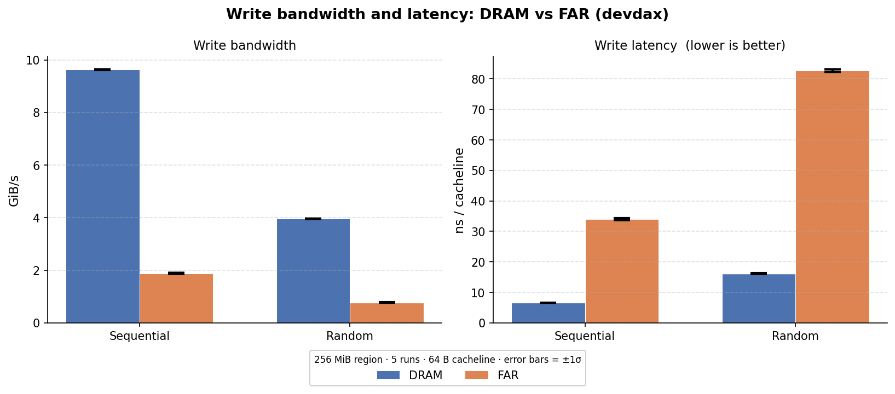
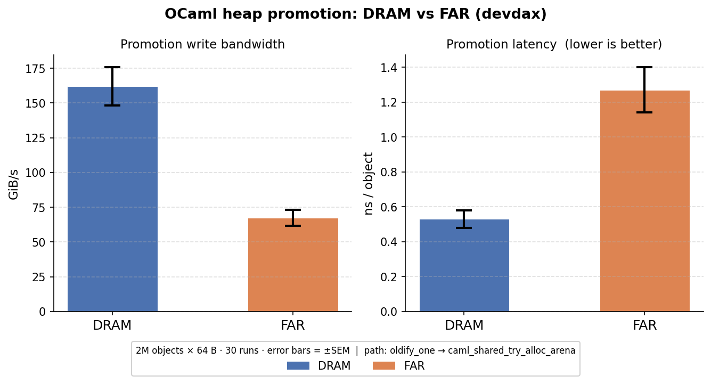

# Week 4 — Tiered Major-Heap Scaffolding

## 1. Goal

OCaml's major heap is a single-arena pool allocator backed by anonymous
`mmap`.  The long-term goal of this project is to let the GC route
*critical* objects (hot data, long-lived structures) to fast DRAM while
demoting cold garbage to a cheaper, slower CXL-attached far-memory tier,
reducing effective memory cost without sacrificing latency for the working
set.

Week 4 delivers the runtime scaffolding that makes this possible:

- A second major-heap arena backed by `/dev/dax2.0` (a 744 GiB
  CXL-attached devdax device, NUMA node 6).
- Arena identity threaded through every major-heap data structure so that
  pools, large allocations, sweep cursors, and compaction all know which
  tier they are operating on.
- A temporary global routing switch (`OCAML_FAR_ALL=1`) that steers all
  minor-GC promotions to the far arena, allowing end-to-end validation
  without a promotion policy.

No source-level attributes, criticality metrics, or compiler changes are
included; those are Week 5+.

---

## 2. Design

### 2.1 DAX pool allocator (`runtime/dax_arena.c`)

The arena is a single global struct, initialised once at startup.  Init
opens `OCAML_DAX_DEVICE` (default `/dev/dax2.0`) and maps
`OCAML_DAX_BYTES` (default 8 GiB) with `MAP_SHARED`.  `MAP_SHARED` is
mandatory: `MAP_PRIVATE` silently COWs into anonymous DRAM and writes
never reach the device.

The mapped region is split into two zones:

```
[base,            base + large_zone)   bump-pointer large allocs (≥ SIZECLASS_MAX)
[base + large_zone, base + total)      pool zone, sliced into 32 KiB pools
```

Pool acquisition pops from a LIFO free list; on exhaustion it advances a
cursor through the pool zone.  Released pools return to the free list and
are never unmapped.  Large allocations use a monotonic bump cursor; freed
regions are not reclaimed (acceptable for Week 4; benchmarking workloads
should not exhaust the 2 GiB large zone).

If the device is absent or inaccessible the arena marks itself
permanently unavailable and all subsequent acquisition requests return
`NULL`, allowing the runtime to degrade gracefully to DRAM-only.

### 2.2 Dual-arena shared heap (`runtime/shared_heap.c`)

A new enum distinguishes the two arenas:

```c
typedef enum { ARENA_DRAM = 0, ARENA_FAR = 1, NUM_ARENAS = 2 } caml_arena_id;
```

Every major-heap data structure was widened from 1-D to 2-D:

| Before | After |
|--------|-------|
| `pool* avail_pools[NUM_SIZECLASSES]` | `pool* avail_pools[NUM_ARENAS][NUM_SIZECLASSES]` |
| `large_alloc* swept_large` | `large_alloc* swept_large[NUM_ARENAS]` |
| `struct pool_freelist_state pool_freelist` | `pool_freelists[NUM_ARENAS]` |

Each `pool` and `large_alloc` carries a 1-byte `arena` field set at
acquisition.  `pool_release` and `large_free` read this field to route
memory back correctly: FAR pools return to `caml_dax_pool_release`;
DRAM pools return to `caml_mem_unmap` or the freelist as before.

The new entry point `caml_shared_try_alloc_arena` accepts an explicit
`caml_arena_id`; the existing `caml_shared_try_alloc` becomes a one-line
wrapper passing `ARENA_DRAM`, preserving the ABI for all current callers.

**Sweep** iterates arenas in order (DRAM first, then FAR) using a new
`next_arena_to_sweep` cursor in `caml_heap_state`.

**Compaction** (Edwards Two-Finger): Phase 1 (object evacuation) runs
only on `ARENA_DRAM` pools because the FAR bump allocator is
non-reclaiming and live FAR objects cannot be moved.  Phase 2 (pointer
update) scans all arenas so that FAR objects pointing into moved DRAM
objects are correctly patched.

### 2.3 Minor-GC routing (`runtime/minor_gc.c`)

`alloc_shared` was extended with an `arena` parameter.  All four
`oldify_one` call sites pass the result of `choose_arena_week4`:

```c
static caml_arena_id choose_arena_week4(reserved_t reserved) {
  (void)reserved; /* reserved-bit hints arrive in Week 5 */
  if (caml_far_all_promotions) return ARENA_FAR;
  return ARENA_DRAM;
}
```

`caml_far_all_promotions` is a global `int` set once at startup from
`OCAML_FAR_ALL`.  If the DAX arena is unavailable and `OCAML_FAR_ALL=1`
is requested, the runtime logs a warning and keeps all promotions in
DRAM.

### 2.4 Routing summary

```
Gc.minor()
  └─ oldify_one (minor_gc.c)
       └─ choose_arena_week4()          ← OCAML_FAR_ALL controls this
            └─ alloc_shared(..., arena)
                 └─ caml_shared_try_alloc_arena(heap, wosize, tag, reserved, arena)
                      ├─ ARENA_DRAM → pool from caml_mem_map / existing freelist
                      └─ ARENA_FAR  → pool from caml_dax_pool_acquire()
```

---

## 3. Validation

### 3.1 Address-range test (`testsuite/tests/tiered-heap/dax_placement.ml`)

C stubs expose `caml_dax_contains(Hp_val(v))` to OCaml.  The test
allocates 50 000 small objects and 20 large objects, forces promotion
with `Gc.minor()`, then checks that every sampled object lands in the
expected arena:

```
OCAML_FAR_ALL=1 ./dax_placement.byte   # all objects must be in DAX region
./dax_placement.byte                   # all objects must be outside DAX region
```

It also calls `Gc.compact()` to confirm compaction does not crash with
FAR objects present.

### 3.2 Debug assertions (`-DCAML_DEBUG_FAR_ARENA`)

Building with `CFLAGS=-DCAML_DEBUG_FAR_ARENA` enables a post-allocation
`CAMLassert` in `caml_shared_try_alloc_arena` that aborts immediately if
a pointer lands in the wrong arena, catching routing bugs at allocation
time.

### 3.3 Hardware verification

On the live machine, NUMA node membership of promoted objects can be
confirmed with:

```bash
cat /proc/$(pidof myprogram)/numa_maps | grep dax
```

Pages backed by `/dev/dax2.0` appear on target node 6 (the device's
`target_node` per `ndctl list`).  This confirms the kernel is faulting
pages onto the actual CXL device and not silently falling back to DRAM.

---

## 4. Results

All measurements were taken on the test machine with two 744 GiB devdax
namespaces (`dax1.0`, `dax2.0`) on NUMA nodes 5 and 6, and 4 × 96 GB
DRAM NUMA nodes (0–3).

### 4.1 Raw device write bandwidth (`testsuite/tests/tiered-heap/write_bw.c`)

A standalone C benchmark mmaps 256 MiB from each arena and writes every
64-byte cacheline sequentially (stride access) and randomly (LCG-shuffled
cacheline order).  Best-of-5 reported; error bars are ±1σ.

| Arena | Pattern    | Bandwidth (GiB/s) | Latency (ns/line) |
|-------|------------|------------------:|------------------:|
| DRAM  | Sequential |  9.63 ± 0.02      |   6.7 ± 0.0       |
| DRAM  | Random     |  3.96 ± 0.01      |  16.2 ± 0.0       |
| FAR   | Sequential |  1.88 ± 0.02      |  34.0 ± 0.4       |
| FAR   | Random     |  0.77 ± 0.00      |  82.7 ± 0.5       |

FAR is **5.1× slower** than DRAM across both patterns.  The constant
ratio indicates CXL interconnect latency dominates over cache-miss
effects.



### 4.2 OCaml heap promotion latency (`testsuite/tests/tiered-heap/heap_bench.ml`)

An OCaml benchmark allocates 2 million 64-byte objects in the minor
heap, then calls `Gc.minor()` to promote them.  The promotion path goes
through `oldify_one → alloc_shared → caml_shared_try_alloc_arena`.  30
runs; error bars are ±SEM.

| Arena | Bandwidth (GiB/s) | Latency (ns/object) |
|-------|------------------:|--------------------:|
| DRAM  |  162.07 ± 13.64   |    0.53 ± 0.05      |
| FAR   |   67.33 ±  5.69   |    1.27 ± 0.13      |

FAR promotion costs **1.27 ns/object vs 0.53 ns** for DRAM — a **2.4×
slowdown**, narrower than the 5.1× seen in the raw benchmark.  The
difference is structural: pool allocation is sequential by design
(`next_obj` advances one slot at a time through a 32 KiB pool), so the
hardware prefetcher partially hides CXL latency.  Fragmented heaps with
scattered free lists would approach the 5× raw ratio.



---

## 5. Next Steps

**Week 5 (promotion policy):**
- Replace `choose_arena_week4` with a real policy that reads criticality
  hints from the `reserved` bits of the object header.  The function
  signature is already pinned to accept `reserved_t`; the body is the
  only change required.
- Delete `caml_far_all_promotions` and the `OCAML_FAR_ALL` env var once
  the real policy is in place.

**Correctness gaps to close:**
- FAR large allocations use a monotonic bump allocator with no
  reclamation.  A free list for large FAR blocks is needed before
  production use.
- Compaction Phase 1 currently skips FAR pools.  Once reserved-bit
  preservation lands, FAR objects should either be evacuated to a fresh
  FAR region or pinned in place with a flag the compactor respects.
- Per-arena stats (`pool_words`, `large_words`, etc.) are currently
  folded into the DRAM freelist counters.  Split them for accurate
  `Gc.stat` reporting.

**Benchmarking:**
- The promotion benchmark should be extended to measure a mixed workload
  (some objects hot, some cold) once the per-object policy is in place,
  to quantify the benefit of selective placement rather than the
  all-or-nothing routing tested here.
